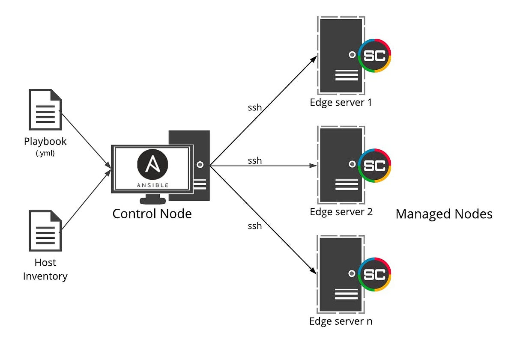

# Ansible


Ansible is a configuration management tool whose main purpose is to help **automatically** provision servers

In a standard architecture, a machine (called an *ansible control host*) serves as a middle man between the operator of ansible (me) and the servers to provision. This control host connects directly to the servers (via SSH) and issues commands to provision them. 

An alternative to this, is to have the operator workstation (my laptop), act as a control host directly, skipping the machine in the middle. 



> Its important to highlight that in both of these setups, the servers to be provisioned **don't** have Ansible installed


## Previous setup

### SSH

SSH needs to be configured, as it is the main way that ansible uses to send commands to the servers. This means that:

- The control node must have openssh client installed
- The servers must have openssh server installed

As general good practice, the use of ssh keys instead of passwords is recommended. There is multiple type of keys to generate, the example below generates a ED25519 key: 

```bash
ssh-keygen -t ed25519 -C "some key"
```

The key can have a password to unlock it. This is recommended for **personal** keys, but in the case of creating a key for ansible to use, it's better to skip it. 

Once a key is created it can be added to a server using the command:

```bash
ssh-copy-id -i ~/.ssh/id_rsa.pub <USER>@<IP>
```

For this the user must already exist in the machine, and the machine running the command should also have ssh access. 

> The first time that a connection to a new server is established, the ssh client will ask for confirmation. It is common to do this first connection manually to avoid "messing" with Ansible when it tries to connect. Alternatively, ansible can also be [configured to automatically accept](https://stackoverflow.com/questions/32297456/how-to-ignore-ansible-ssh-authenticity-checking)

### Git

In a normal production workflow, ansible scripts and playbooks are stored in a git repository. This allows to control and have a unified version of the scripts.


## Getting Started

### Installing Ansible

Ansible can be installed from their direct repository, using `pip` or directy from many linux distribution package stores. 

More info can be seen [here](https://docs.ansible.com/ansible-core/devel/installation_guide/installation_distros.html)

To install in ubuntu:

```bash
sudo apt update
sudo apt install software-properties-common
sudo add-apt-repository --yes --update ppa:ansible/ansible
sudo apt install ansible
```

### Inventory File

To know which machines are available to control, ansible needs an inventory file. This file simply describes (with the ip addresses) which machines are to be controled

The inventory files allow also to group and set up different configuration values for each server. They can be defined in `ini` or `yaml` formats (depending what is easier to read given the architecture)

Even if no groups are defined in the inventory file, Ansible creates two default groups: `all` and `ungrouped`. The `all` group contains every host. The ungrouped group contains all hosts that don’t have another group aside from `all`. Threfore every host will always belong to at least 2 groups (`all` and `ungrouped` or `all` and some other group)

Once the inventory is organized, commands can be run on all host in a group with:
```bash
ansible mygroup ...
ansible all ...
```

More information can be found in the [documentation](https://docs.ansible.com/ansible/latest/inventory_guide/intro_inventory.html#how-to-build-your-inventory)


### Running ad-hoc commands

Although the core of ansible is using playbooks, the cli tool can be user to directly execute commands or run modules. They work great for tasks that are run not that ofter.  

For running a command the following is needed:
- Inventory group name 
- Key to use when connecting via SSH
- Inventory file location
- Module or command

This can all be passed in the cli. For example, the following command uses the `ping` [module](https://docs.ansible.com/ansible/latest/collections/ansible/builtin/ping_module.html) to verify connection to all servers:

```bash
ansible all --key-file ansible.key -i inventory.ini -m ping
```

Most of the repetitive values however, can be put inside a `ansible.cfg` file. A local file will override configuration in `/etc/ansible/ansible.cfg`. [Configuration](https://docs.ansible.com/ansible/latest/reference_appendices/config.html) can also be done via environment variables:

```cfg
[defaults]
inventory = inventory.ini
private_key_file = ./ansible.key
remote_user = ansible
```

That way, the following command (that uses the `gather_facts` module to get information of the servers) works:

```bash
ansible all -m gather_facts
```

#### Elevated commands

Ansible uses existing privilege escalation systems to execute tasks with root privileges or with another user’s permissions. Because this feature allows you to ‘become’ another user, different from the user that logged into the machine (remote user), its called `become`. The `become` keyword uses existing privilege escalation tools like `sudo`, `su`, etc (using `sudo` by default)

If nothing else is specified, the `become` keyword will try to run the commands as the `root` user. The password can be passed via a file (using the `--become-password-file` option) or be prompted (`-K` or `--ask-become-pass`). More information can be seen in the [docs](https://docs.ansible.com/ansible/latest/playbook_guide/playbooks_privilege_escalation.html)

Example of ad-hoc elevated commands are:

- Update package cache in all servers (`apt update`)
    ```bash
    ansible all -m apt -a update_cache=true --become --ask-become-pass
    ```

- Update and upgrade all packages (`apt upgrade`)
    ```bash
    ansible all -m apt -a upgrade=yes --become --ask-become-pass
    ```
